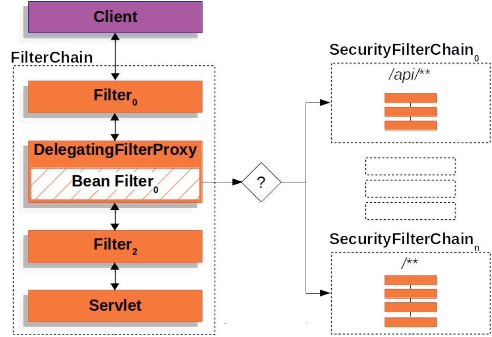

# Spring Security Core - Spring MVC Monolith

##  Custom Authentication Filter


####  Spring Security Filters:

All **Spring Security Filters** implement the **Filter interface**
- Part of the **Java Servlet API**
	- Accepts **Servlet Request**, **Servlet Response**, and **Filter Chain**
	- Can be used to implement **actions** 	on the **Request** or **Response**
- **HTTP Basic Authentication** is using the filter **BasicAuthenticationFilter** : Inspects Request for HTTP Basic credentials and performs Authentication

-------

####  Custom Spring Security Filter Use Case:

We have a **REST API** using **custom headers** for **Authentication**
- Mimic a legacy application : This is not a **recommended approach** for **Authentication**.
- Legacy Application sending **API key** and **API Secret** in **HTTP Headers**.
- Create a S**pring Security filter** for this legacy **Authentication**
	- Extend Spring Security's **AbstractAuthenticationProcessingFilter**
	- **Configure Spring Security** to use **Custom Filter**
	
-----------	
####   Example of Spring Security Filters

##### Step 1 - Create a failing test

```java
    @Test
    void deleteDrink() throws Exception {
        mockMvc.perform(delete("/api/v1/drink/493410b3-dd0b-4b78-97bf-289f50f6e74f")
                .header("Api-Key", "customer")
                .header("Api-Secret", "password"))
                .andExpect(status().isOk());
    }
```


##### Step 1 - Create a filter : RestHeaderAuthFilter

we've override the method for **attemptAuthentication**, extracting out the username and password from the request, creating Username, **passwordAuthenticationToken** and then passing that into the **authentication manager** which performs the **authentication**. 
We are using **in-memory authentication manager** so **authentication manager** will do the **authentication** against that.

```java
public class RestHeaderAuthFilter extends AbstractAuthenticationProcessingFilter {

    public RestHeaderAuthFilter(RequestMatcher requiresAuthenticationRequestMatcher) {
        super(requiresAuthenticationRequestMatcher);
    }
  
    @Override
    public Authentication attemptAuthentication(HttpServletRequest httpServletRequest,
                                                HttpServletResponse httpServletResponse)
            throws AuthenticationException, IOException, ServletException {

        String userName = getUserName(httpServletRequest);
        String password = getPassword(httpServletRequest);

        //as we don't know if getAuthenticationManager().authenticate is null safe operations
        if (userName == null) userName = "";
        if (password == null) password = "";

        log.debug("Authenticating User: " + userName);

        UsernamePasswordAuthenticationToken token = new UsernamePasswordAuthenticationToken(userName, password);

        return this.getAuthenticationManager().authenticate(token);
    }

    private String getUserName(HttpServletRequest httpServletRequest) {
        return httpServletRequest.getHeader("Api-Key");
    }

    private String getPassword(HttpServletRequest httpServletRequest) {
        return httpServletRequest.getHeader("Api-Secret");
    }
}
```


##### Step 2 - Complete the Spring configuration to support the use of the RestHeaderAuthFilter filter.

we need to create a new method **restHeaderAuthFilter** within **SecurityConfig**, which takes an **AuthenticationManager** where we are passing in an **AntPathRequestMatcher**. i.e. we're going to match on all the `/api` URLs in the application. So that's what we're limiting the **scope** to this authentication. 

```java
@Configuration
@EnableWebSecurity
public class SecurityConfig extends WebSecurityConfigurerAdapter {

    public RestHeaderAuthFilter restHeaderAuthFilter(AuthenticationManager authenticationManager){
        RestHeaderAuthFilter filter = new RestHeaderAuthFilter(new AntPathRequestMatcher("/api/**"));
        filter.setAuthenticationManager(authenticationManager);
        return filter;
    }
	....
```

And then we are adding the filter in to the **Spring Security filter chain** to execute before the user name and password **authentication filter**.

```java
@Override
    protected void configure(HttpSecurity http) throws Exception {

        http.addFilterBefore(restHeaderAuthFilter(authenticationManager()),
                UsernamePasswordAuthenticationFilter.class);
        http
                //this should before the 2nd authorizeRequests,
                //because the 2nd authorizeRequests is for anyRequest()!!!
                .authorizeRequests(expressionInterceptUrlRegistry -> {
                    expressionInterceptUrlRegistry
                            //Permit root path & static assets
                            .antMatchers("/", "/webjars/**", "/login", "/resources/**").permitAll()

                            //drinks*: allow any query params
                            //&  /drinks/find
                            .antMatchers("/drinks/find", "/drinks*").permitAll()

                            //rest controller filter
                            .antMatchers(HttpMethod.GET, "/api/v1/drink/**").permitAll()
                            .mvcMatchers(HttpMethod.GET, "/api/v1/drinkUpc/{upc}").permitAll()
                    ;
                })

                //Any other request rules!
                .authorizeRequests()
                .anyRequest().authenticated()
                .and()
                .formLogin()
                .and()
                .httpBasic();
    }
```

##### Step 3 -  Debugging Spring Security

We need to set some debugging since the test are failing.

```properties
logging.level.com.elearning.drink.drinkfactory=debug
logging.level.org.springframework.security=debug 
```


We will disable/turn off `CSRF` to avoid `Invalid CSRF token found for http://localhost/api/v1/drink/493410b3-dd0b-4b78-97bf-289f50f6e74f`

```java
 @Override
    protected void configure(HttpSecurity http) throws Exception {

        http.addFilterBefore(restHeaderAuthFilter(authenticationManager()),
                UsernamePasswordAuthenticationFilter.class)
        .csrf().disable();
        ...
    }

```


We are getting a `302 action` which is a `redirect`, because we are using a **default authentication success**. So we have authentication success and we are updating the **Spring Security context**, what we need to do is customize our **authentication success**.

**Debug output**
```
2021-01-23 16:49:58.439 DEBUG 8468 --- [           main] o.s.s.authentication.ProviderManager     : Authentication attempt using org.springframework.security.authentication.dao.DaoAuthenticationProvider
2021-01-23 16:50:03.630 DEBUG 8468 --- [           main] c.e.d.d.security.RestHeaderAuthFilter    : Authentication success. Updating SecurityContextHolder to contain: org.springframework.security.authentication.UsernamePasswordAuthenticationToken@f279cd9d: Principal: org.springframework.security.core.userdetails.User@24217fde: Username: customer; Password: [PROTECTED]; Enabled: true; AccountNonExpired: true; credentialsNonExpired: true; AccountNonLocked: true; Granted Authorities: ROLE_CUSTOMER; Credentials: [PROTECTED]; Authenticated: true; Details: null; Granted Authorities: ROLE_CUSTOMER
2021-01-23 16:50:03.630 DEBUG 8468 --- [           main] RequestAwareAuthenticationSuccessHandler : Using default Url: /
2021-01-23 16:50:03.630 DEBUG 8468 --- [           main] o.s.s.web.DefaultRedirectStrategy        : Redirecting to '/'
```


##### Step 4 - Overrides doFilter method

We are extending out this **AbstractAuthenticationProcessingFilter** and we are using the **Spring Security** implementation and using the default **doFilter** method implementation.

It's doing a number of different **operations** as far as the **authorization result**, like **continueChainBeforeSuccessfulAuthentication**. And then also doing **action** on **successfulAuthentication**, And the **problem** is if it's not successful, it is **throwing an exception** and **failing it**, and it's not working properly. 


```java
 @Override
    public void doFilter(ServletRequest req, ServletResponse res, FilterChain chain)
            throws IOException, ServletException {

        HttpServletRequest request = (HttpServletRequest) req;
        HttpServletResponse response = (HttpServletResponse) res;

        log.debug("Request is to process authentication");

        Authentication authResult = attemptAuthentication(request, response);

        //attemptAuthentication result is not null
        if (authResult != null) {
            successfulAuthentication(request, response, chain, authResult);

        } else {
            //attemptAuthentication result is null
            chain.doFilter(request, response);
        }
    }
```

##### Step 5 - Overrides successfulAuthentication method
```java
 @Override
    protected void successfulAuthentication(HttpServletRequest request,
                                            HttpServletResponse response,
                                            FilterChain chain,
                                            Authentication authResult) throws IOException, ServletException {
        log.debug("Authentication success. Updating SecurityContextHolder to contain: " + authResult);
        //this is a rest API, we don't need is this rememberMeServices (i.e. rememberMe cookie) or to fire an event.

        //using SecurityContextHolder, getting the context and then setting in the authResult.
        //which establishes the authorization within the context of Spring Security.
        SecurityContextHolder.getContext().setAuthentication(authResult);
    }
```


##### Step 6 - Readjust attemptAuthentication method

```java
 //we've override the method for attemptAuthentication, extracting out the username and password from the request,
    //creating Username, PasswordAuthenticationToken and then passing that into the authentication manager
    //which performs the authentication.
    //We are using in-memory authentication manager so it will do the authentication against that.
    @Override
    public Authentication attemptAuthentication(HttpServletRequest request,
                                                HttpServletResponse response)
            throws AuthenticationException, IOException, ServletException {

        String userName = getUserName(request);
        String password = getPassword(request);

        //as we don't know if getAuthenticationManager().authenticate is null safe operations
        if (userName == null) userName = "";
        if (password == null) password = "";

        log.debug("Authenticating User: " + userName);

        UsernamePasswordAuthenticationToken token = new UsernamePasswordAuthenticationToken(userName, password);

        //If we are setting a username, go ahead and return the AuthenticationManager.
        if (!StringUtils.isEmpty(userName))
            return this.getAuthenticationManager().authenticate(token);
        else
            //null, we just want to skip things,
            //So we'll just return null for this implementation that we are setting up for ourselves.
            return null;
    }

```

##### Step 7 - Fix the case of wrong credentials - Custom Failure Handler

We get still `org.springframework.security.authentication.BadCredentialsException: Bad credentials` from `com.elearning.drink.drinkfactory.security.RestHeaderAuthFilter.doFilter(RestHeaderAuthFilter.java:65)`

```java
    @Override
    public void doFilter(ServletRequest req, ServletResponse res, FilterChain chain)
            throws IOException, ServletException {

        HttpServletRequest request = (HttpServletRequest) req;
        HttpServletResponse response = (HttpServletResponse) res;

        log.debug("Request is to process authentication");

        try {

            Authentication authResult = attemptAuthentication(request, response);
            //attemptAuthentication result is not null
            if (authResult != null) {
                successfulAuthentication(request, response, chain, authResult);

            } else {
                //attemptAuthentication result is null
                chain.doFilter(request, response);
            }
        } catch (AuthenticationException failed) {
            // Authentication failed
            log.error("Authentication failed", failed);
            unsuccessfulAuthentication(request, response, failed);
        }
    }
```


##### Step 8 - override the unsuccessfulAuthentication default implementation

The most important implementation in the **AbstractAuthenticationProcessingFilter superclass** of **unsuccessfulAuthentication** is : 
-  The clearing the content `SecurityContextHolder.clearContext();`; removing any type of authentication.
-  `RememberMeServices`, `loginFail`, which is something that we don't need on **RestfulAPI**.
-  The `failureHandler` with `onAuthenticationFailure`; that is an interface with **several implementations** and from the log context, we are using the **simpleUrlAuthenticationFailure** Handler which performs a serveral operations but the most importanty is to send back of response error `response.sendError`, but the forward Url page not needed on **RestfulAPI**.


**unsuccessfulAuthentication** method adjusted to our need: 

```java
   @Override
    protected void unsuccessfulAuthentication(HttpServletRequest request,
                                              HttpServletResponse response, AuthenticationException failed)
            throws IOException, ServletException {
        SecurityContextHolder.clearContext();
        log.debug("Authentication request failed: " + failed.toString(), failed);
        log.debug("Updated SecurityContextHolder to contain null Authentication");
        
        response.sendError(HttpStatus.UNAUTHORIZED.value(),
                HttpStatus.UNAUTHORIZED.getReasonPhrase());
    }

```


#### Refactored RestHeaderAuthFilter & added a new RestParamAuthFilter

**RestHeaderAuthFilter** is use to check credentials coming in the header, while **RestParamAuthFilter** is checking credentials coming in params, common logic has been moved to **AbstractRestAuthFilter**.

This kind of **authentication is not recommended** and shown here for the purpose of the exercice.