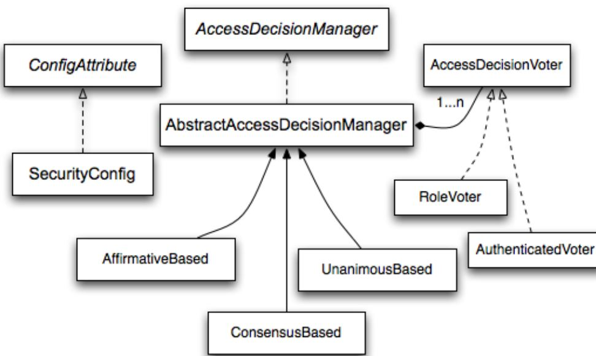

# Spring Security Core - Spring MVC Monolith

## User Roles 

### Authorization in Spring Security

- **Authorization** is the approval to **perform** an **action** within the application
- Authorization can be as simple as **allow all** or is **authenticated**
- **Specific actions** can be **limited** to **specific roles** or **authorities**
- By **default**, **Spring Security roles** start with `ROLE_` : Example: `ROLE_ADMIN`
- **Spring Security authorities** may be **any** **string value** 


### Roles vs Authorities 
- Typically a **role** is considered a **group** of **one** or **more authorities**.
- In a Spring Security context: **Roles** by **default** start with `ROLE_`, **Configuration** uses methods of **hasRole()** or **hasAnyRole()**, and **requires prefix**.
- **Authorities** are any string : **Configuration** uses methods of **hasAuthority()** or **hasAnyAuthority()**



### Access Decision Voters

Access Decision Voters provide a vote on allowing access:
- **ACCESS_ABSTAIN** : Voter has no opinion.
- **ACCESS_DENIED** : Voter does not approve.
- **ACCESS_GRANTED** : Voter approves access.
-------

### Role Voter

- Most **commonly used** voter in **Spring Security**.
- Uses **role names** to grant **access**.
- If **Authenticated** user has **role**, **access** is **granted** : If **no authorities** begin with **prefix** of `ROLE_` this **voter** will **abstain**. 
-------

### Authenticated Voter

**Grants Access** based on **level** of **authentication**:
- **Anonymously**: Not Authenticated.
- **Remembered**: Authenticated via Remember me **cookie**.
- **Fully**: Fully Authenticated .
-------

### Consensus Voter
- **Accepts** list of **Access Decision** voters.
- **Polls** each **voter**.
- **Access granted** based on total of **allowed** vs **denied** **responses**.
-------

### Role Hierarchy Voter

- Allows **configuration** of **Role Hierarchies**.
- Example:
	- `ROLE_USER`.
	- `ROLE_ADMIN` > `ROLE_USER` > `ROLE_FOO`.
- `ROLE_ADMIN` will have all of its **authorities**, and those of `ROLE_USER` and `ROLE_FOO`.
-------

### Security Expressions

- **permitAll**: Allows all access.
- **denyAll**: Denies all access.
- **isAnonymous**: Is Authenticated Anonymously.
- **isAuthenticated**: Is Authenticated (Fully or Remembered).
- **isRememberMe**: Is Authenticated with Remember Me **Cookie**.
- **isFullyAuthenticated**: Is Fully Authenticated.
- **hasRole**: Has authority with `ROLE_***`
- **hasAnyRole**: Accepts list of `ROLE_***` strings
- **hasAuthority**: Has authority string value
- **hasAnyAuthority**: Accepts list of string authority values
- **hasIpAddress**: accepts IP Address or IP/Netmask 
-------

### Http Filter Security Interceptor

- **Securing** specific **URLs** is done using **Spring Security Filters**.
- **Filters** use **configured voters** to determine **authorization**.
- **Security expressions** available for use in **Java configuration of HttpSecurity**.
-------

### Method Security

- **Spring Security** also has **method level security**.
- Enable using `@EnableGlobalMethodSecurity` configuration annotation.
- `@Secured` : accepts list of **roles**, or **IS_AUTHENTICATED_ANONYMOUSLY**.
- `@PreAuthorize` : accepts **security expressions**
- Under covers **Spring Security** is using **AOP** to **intercept** and use the **AccessDecisionManager** : Same technique as **Filter**.
-------


### Adding User Roles

We need to prefix authorities with `ROLE_`

```java
@Slf4j
@RequiredArgsConstructor
@Component
public class UserDataLoader implements ApplicationListener<ContextRefreshedEvent> {
    private final AuthorityRepository authorityRepository;
    private final UserRepository userRepository;
    private final PasswordEncoder passwordEncoder;


    private void loadSecurityData() {
        Authority adminRole = authorityRepository.save(Authority.builder().role("ROLE_ADMIN").build());
        Authority customerRole = authorityRepository.save(Authority.builder().role("ROLE_CUSTOMER").build());
        Authority userRole = authorityRepository.save(Authority.builder().role("ROLE_USER").build());

        userRepository.save(User.builder()
                .username("admin")
                .password(passwordEncoder.encode("password"))
                .authority(adminRole) //@Singularity
                .build());

        userRepository.save(User.builder()
                .username("customer")
                .password(passwordEncoder.encode("password"))
                .authority(customerRole) //@Singularity
                .build());

       User domainUser = userRepository.save(User.builder()
                .username("user")
                .password(passwordEncoder.encode("password"))
                .authority(userRole) //@Singularity
                .build());

        log.debug("users Loaded: " + userRepository.count());
        log.debug("roles Loaded: " + authorityRepository.count());

    }

    @Override
    public void onApplicationEvent(ContextRefreshedEvent event) {
        if (authorityRepository.count() == 0) loadSecurityData();


    }
}
```

We have also to modify **SecurityConfig.configure(HttpSecurity http)** to include the `ADMIN` role without prefix `ROLE_`, because it will be inserted.

The same goes for `CUSTOMER` role-> checkout the integration tests.

```java
    @Override
    protected void configure(HttpSecurity http) throws Exception {


        http.addFilterBefore(restHeaderAuthFilter(authenticationManager()),
                UsernamePasswordAuthenticationFilter.class)
                .csrf().disable();


        http.addFilterBefore(restParamAuthFilter(authenticationManager()),
                UsernamePasswordAuthenticationFilter.class)
        //.csrf().disable() : no need here, handles globally before.
        ;

        http
                //this should before the 2nd authorizeRequests,
                //because the 2nd authorizeRequests is for anyRequest()!!!
                .authorizeRequests(expressionInterceptUrlRegistry -> {
                    expressionInterceptUrlRegistry
                            //Permit root path & static assets
                            .antMatchers("/", "/webjars/**", "/login", "/resources/**").permitAll()
                            .antMatchers("/h2-console/**").permitAll() //don't use in production

                            //drinks*: allow any query params
                            //&  /drinks/find
                            .antMatchers("/drinks/find", "/drinks*").permitAll()
                            .mvcMatchers("/brewery/breweries**").hasAnyRole("CUSTOMER","ADMIN")

                            //rest controller filter
                            .antMatchers(HttpMethod.GET, "/api/v1/drink/**").permitAll()
                            .mvcMatchers(HttpMethod.DELETE, "/api/v1/drink/**").hasRole("ADMIN")
                            .mvcMatchers(HttpMethod.GET, "/brewery/api/v1/breweries**")
                            .hasAnyRole("CUSTOMER","ADMIN")
                            .mvcMatchers(HttpMethod.GET, "/api/v1/drinkUpc/{upc}").permitAll()
                    ;
                })

                //Any other request rules!
                .authorizeRequests()
                .anyRequest().authenticated()
                .and()
                .formLogin()
                .and()
                .httpBasic();

        //by default, Spring Security is preventing frames
//        http.headers().frameOptions().disable();
        http.headers().frameOptions().sameOrigin();
    }
```

  
**Notes**: 
- **Forbidden**: user authenticated but not allowed access to the ressource.
- **Unauthorised**: user not authenticated.


